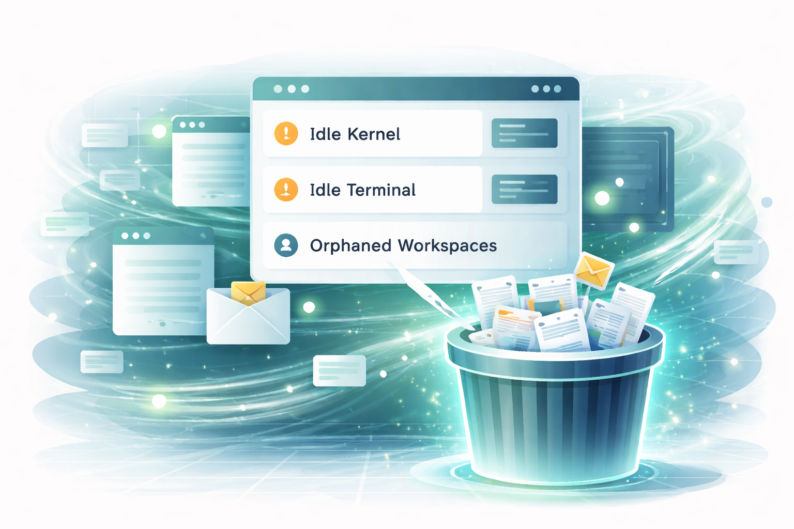
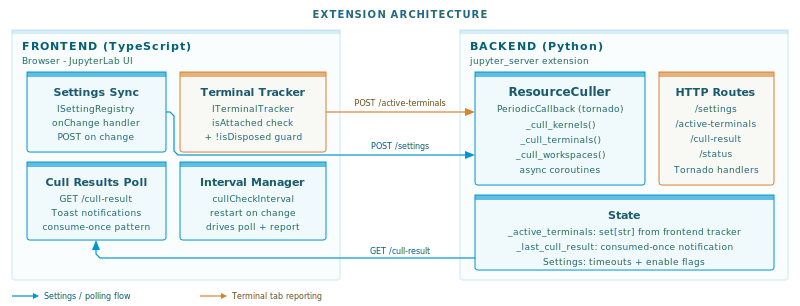
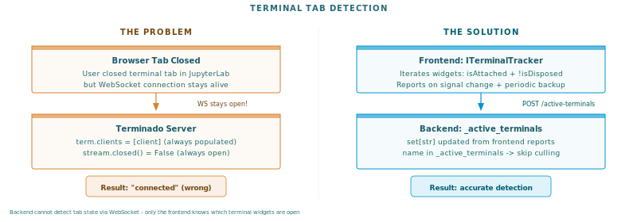
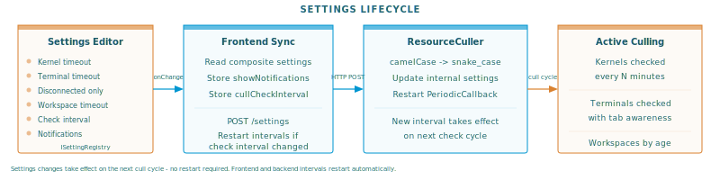
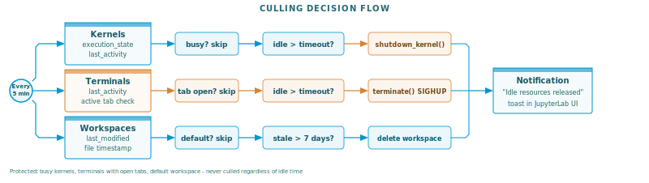

# Your JupyterLab Is Hoarding Dead Sessions. Here's How I Fixed It.



If you've ever opened JupyterLab and found 47 idle kernels, 12 orphaned terminals, and a collection of auto-named workspaces that nobody remembers creating - this article is for you.

I built a JupyterLab extension that automatically cleans up idle resources after configurable timeout periods. Along the way I learned that JupyterLab's extension system is far more capable than most people realize - and that many of the small frustrations we accept as "just how things are" can be solved with a targeted extension. This is the story of building one.

## JupyterLab Has Rough Edges. You Can Fix Them.

JupyterLab is the best interactive computing environment we have. But it's not perfect. If you've used it for any length of time, you've probably built up a mental list of things that could work better. Resource cleanup is one of them. Terminal behavior is another. Notifications, keyboard shortcuts, workspace management - the list goes on.

Here's what I want you to take away from this article: every item on that list is a potential extension. JupyterLab's architecture was designed for exactly this kind of improvement. The frontend exposes widget trackers, signal systems, and a settings registry. The backend gives you access to kernel managers, terminal managers, and the full tornado event loop. You can build a server-side extension in Python that talks to a frontend extension in TypeScript, and the two halves coordinate through typed HTTP endpoints.

The resource culler started as a weekend project to solve one annoyance. It turned into a full extension with a settings UI, a CLI tool, and notification support. And the hardest part wasn't writing code - it was discovering that JupyterLab's terminal WebSocket behavior doesn't work the way you'd expect. That kind of discovery only happens when you start building.

## The Problem: Resource Sprawl

JupyterLab is generous with resources. Open a notebook, get a kernel. Open a terminal, get a shell process. Open a new browser window, get a new workspace file. Close the tab, and... nothing happens. The kernel keeps running. The terminal keeps its process alive. The workspace file sits in `~/.jupyter/lab/workspaces/` forever.

On a personal laptop, this is a minor annoyance. On a shared server with 20 data scientists, it's a slow-motion resource leak. I've seen machines with 30 GB of RAM consumed by kernels that nobody was using, running notebooks that finished hours ago.

JupyterLab has no built-in mechanism to clean up idle resources. Kernels, terminals, and workspaces accumulate silently until someone notices the server is running out of memory.

I wanted one extension that handles all three resource types, with a settings UI so users can adjust timeouts without touching config files.

## The Architecture



JupyterLab extensions have two sides. The frontend is TypeScript, running in the browser. The backend is Python, running as a `jupyter_server` extension. They communicate over HTTP.

The culler lives primarily on the backend. A `ResourceCuller` class uses Tornado's `PeriodicCallback` to wake up every N minutes (default: 5) and check what's idle. The frontend's job is simpler: sync settings from the JupyterLab Settings Editor to the backend, poll for culling results, and show notifications.

Settings flow from the Settings Editor through the frontend to the backend on every change. The frontend posts the full composite settings object. The backend maps camelCase keys to snake_case and restarts its periodic callback if the check interval changed.

This pattern - frontend for UI integration, backend for actual work - applies to most JupyterLab extensions. Once you understand the boundary, building new ones gets much faster.

## Kernel Culling: The Easy One

Kernels are straightforward. Each kernel exposes `execution_state` and `last_activity`. A kernel is idle when it's not executing and its `last_activity` timestamp exceeds the timeout.

The rule is simple: busy kernels are never culled. If your long-running training job is still executing, the culler leaves it alone. Only truly idle kernels - sitting there doing nothing for over an hour - get shut down.

```python
execution_state = getattr(kernel, "execution_state", "idle")
if execution_state == "busy":
    continue

idle_seconds = (now - last_activity).total_seconds()
if idle_seconds > timeout_seconds:
    await self.kernel_manager.shutdown_kernel(kernel_id)
```

This was the first thing I built. It worked on the first try. I should have been suspicious.

## Terminal Culling: Where Things Got Interesting

Terminals were supposed to be just as simple. Each terminal has a `last_activity` timestamp. Check if it's past the timeout, call `terminate()`, done.

But I wanted a smarter default: only cull terminals that don't have a browser tab open. If you're looking at a terminal, you probably want it. If you closed the tab 30 minutes ago and forgot about it, that's fair game for cleanup.

This is where I hit the wall.

### The WebSocket Problem



My first approach was obvious. JupyterLab terminals use WebSocket connections. When a tab is open, there's a WebSocket. When it's closed, no WebSocket. Just check for connected clients on the server side.

I checked Terminado's internals. Every terminal has a `clients` set and a stream object. Perfect - just check if clients is empty and the stream isn't closed.

It didn't work. Every terminal always showed as "connected." Even terminals whose tabs I had closed minutes ago.

After a few hours of debugging, I found the reason: JupyterLab intentionally keeps WebSocket connections alive after tab close. This is a feature, not a bug - it supports reconnection. If you accidentally close a terminal tab and reopen it, JupyterLab reconnects to the same terminal session. The WebSocket connection is maintained by the application layer, not the browser tab.

The backend simply cannot know whether a browser tab is open. Only the frontend knows that.

### The Fix: Frontend Reports What It Sees

The solution was to flip the information flow. Instead of the backend trying to detect connections, the frontend reports which terminals have open tabs.

JupyterLab provides `ITerminalTracker`, a widget tracker that knows about every open terminal widget. The frontend iterates the tracker, collects terminal names where `widget.isAttached && !widget.isDisposed`, and POSTs the list to the backend every check interval.

```typescript
tracker.forEach(widget => {
  const name = widget.content.session?.name;
  if (name && widget.isAttached && !widget.isDisposed) {
    activeTerminals.push(name);
  }
});

await requestAPI('active-terminals', {
  method: 'POST',
  body: JSON.stringify({ terminals: activeTerminals })
});
```

The backend stores this as a simple `set[str]`. During culling, it checks `name in self._active_terminals` instead of poking at WebSocket internals.

I also connected the report to `terminalTracker.currentChanged` and `widgetAdded` signals for immediate updates when tabs open or close. The periodic report is a backup for edge cases.

One subtle detail: I initially included `widget.isVisible` in the check. Bad idea. `isVisible` is false when a terminal tab exists but a different tab is selected in the same panel. That would cause the culler to kill terminals just because the user was looking at a notebook. The correct check is `isAttached` (the widget has a place in the DOM) and `!isDisposed` (it hasn't been destroyed).

This kind of gotcha is typical of JupyterLab extension development. The APIs are well-designed, but some behaviors only become apparent when you test specific edge cases. And that's fine - every edge case you document makes it easier for the next person.

## Workspace Culling: Cleaning Up the Auto-Named Clutter

Every time you open JupyterLab in a new browser window, it creates a workspace file - `auto-0`, `auto-k`, random suffixes. These store the UI layout for that specific window. Over time, you accumulate dozens of them in `~/.jupyter/lab/workspaces/`.

Workspace culling checks the file's `last_modified` timestamp. The default timeout is 7 days - if a workspace file hasn't been touched in a week, it's probably safe to remove.

One important protection: the `default` workspace is never culled. That's your primary layout. Everything else is fair game after the timeout.



## How It All Comes Together



Every check cycle, the culler runs through all three resource types. Each has its own protection rules: busy kernels are skipped, terminals with open tabs are preserved, and the default workspace is always safe. Only resources that are genuinely idle and unattended get cleaned up.

Default settings:

| Resource   | Timeout | Protection                     |
| ---------- | ------- | ------------------------------ |
| Kernels    | 60 min  | Busy kernels never culled      |
| Terminals  | 60 min  | Open tabs never culled         |
| Workspaces | 7 days  | Default workspace never culled |

All timeouts are configurable through JupyterLab's standard Settings Editor. No config files to edit. Change a setting, and it takes effect on the next check cycle.

## The CLI: For When You Want Control

Sometimes you want to see what's running and make culling decisions manually. The extension includes a CLI tool:

```bash
# List all resources with idle times
jupyterlab_kernel_terminal_workspace_culler list

# Preview what would be culled
jupyterlab_kernel_terminal_workspace_culler cull --dry-run

# Actually cull idle resources
jupyterlab_kernel_terminal_workspace_culler cull

# Custom timeouts
jupyterlab_kernel_terminal_workspace_culler cull --kernel-timeout 30
```

The CLI auto-discovers running Jupyter servers and authenticates using available tokens. The `--json` flag outputs machine-readable data, useful for monitoring scripts.

## Installation

```bash
pip install jupyterlab-kernel-terminal-workspace-culler-extension
```

That's it. The extension activates automatically on the next JupyterLab start. Default settings work for most use cases.

## What I Learned

Building this extension reinforced something I keep rediscovering: the hard part is rarely where you expect it. Kernel culling was trivial. Terminal culling - specifically detecting whether a browser tab was open - took more effort than everything else combined.

But the bigger lesson is about JupyterLab itself. The extension system is remarkably capable. Widget trackers, signal-based event handling, a proper settings registry, typed HTTP routes between frontend and backend - these aren't afterthoughts. They're designed to let you build exactly this kind of targeted improvement.

If something in JupyterLab frustrates you, there's a good chance you can fix it. Not by waiting for the core team to prioritize it, not by switching to a different tool, but by writing an extension that does exactly what you need. The APIs are there. The architecture supports it. And every extension you publish makes JupyterLab better for everyone.

The resource culler started because I was tired of manually cleaning up idle kernels on a shared server. It's now a published package that anyone can install with one command. Your frustration might be different - maybe it's missing keyboard shortcuts, or notification behavior, or workspace management. Whatever it is, consider building the fix. The JupyterLab extension ecosystem has room for it.

---

_[jupyterlab_kernel_terminal_workspace_culler_extension](https://github.com/stellarshenson/jupyterlab_kernel_terminal_workspace_culler_extension) is open source under MIT license. It's also part of the [stellars_jupyterlab_extensions](https://github.com/stellarshenson/stellars_jupyterlab_extensions) metapackage. Issues and contributions welcome._
